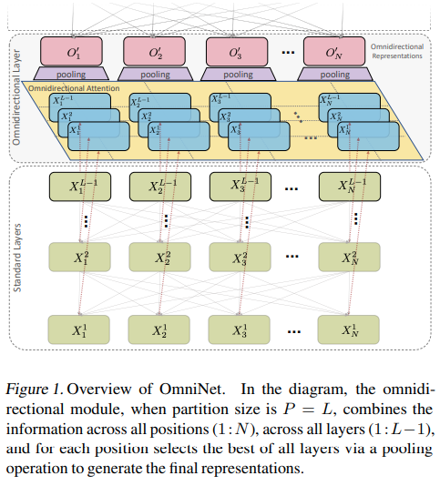

</img>

## Omninet - Pytorch (wip)

Implementation of <a href="https://arxiv.org/abs/2103.01075">OmniNet</a>, Omnidirectional Representations from Transformers, in Pytorch. The authors propose that we should be attending to all the tokens of the previous layers, leveraging recent efficient attention advances to achieve this goal.

## Citations

```bibtex
@misc{tay2021omninet,
    title   = {OmniNet: Omnidirectional Representations from Transformers}, 
    author  = {Yi Tay and Mostafa Dehghani and Vamsi Aribandi and Jai Gupta and Philip Pham and Zhen Qin and Dara Bahri and Da-Cheng Juan and Donald Metzler},
    year    = {2021},
    eprint  = {2103.01075},
    archivePrefix = {arXiv},
    primaryClass = {cs.CV}
}
```
